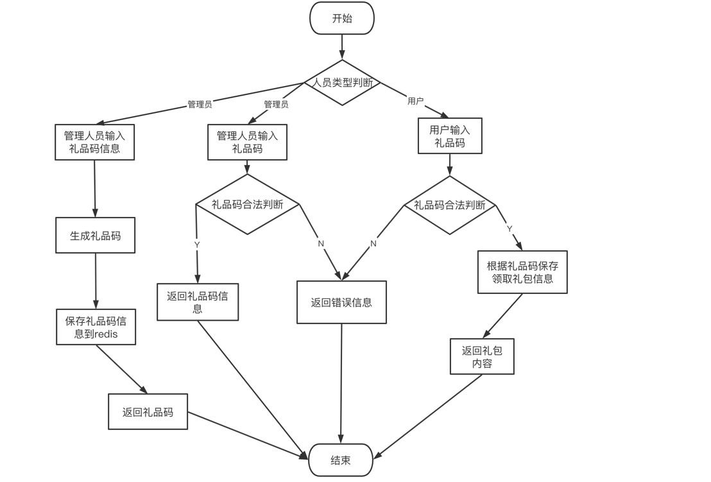

#### 1、整体框架
整体功能的实现思路
礼品码的主要思路是管理人员输入的礼品码信息，以json数据传入，将json数据转存到礼品码信息结构体，并生成8位随机礼品码，将8位随机礼品码为key，礼品信息作为value存入Redis数据库。管理人员根据礼品码查看此礼品码的信息。用户可根据礼品码、用户名获取奖励，并看到奖励内容。

#### 2、目录结构
```
.
├── README.md
├── __pycache__
│   └── locustfile.cpython-39.pyc
├── app
│   └── main.go
├── go.mod
├── go.sum
├── internal
│   ├── ctrl
│   │   └── giftCodeCtrl.go
│   ├── dao
│   │   └── giftCodeDao.go
│   ├── model
│   │   ├── giftCodeInfo.go
│   │   ├── giftContentList.go
│   │   └── receiveGiftList.go
│   ├── router
│   │   └── giftCodeRouter.go
│   ├── service
│   │   ├── giftCodeService.go
│   │   └── giftCodeService_test.go
│   ├── status
│   │   └── ginResult.go
│   ├── test
│   │   ├── locustFile.py
│   │   └── 压测报告.html
│   └── utils
│       ├── getRandomString.go
│       └── initClient.go
└── 礼包码流程图.png


```

#### 3. 代码逻辑分层


|层|文件夹|主要职责|调用关系|其他说明|
| ------------ | ------------ | ------------ | ------------ | ------------ |
|应用层 |app/main.go  |服务器启动 |调用路由层工具层   |不可同层调用
|路由层 |internal/router |路由转发 | 调用工具层 控制层 被应用层调用   |不可同层调用
|控制层 |internal/ctrl |请求参数处理，响应 | 调用service层 被路由层调用    |不可同层调用
|service层   |internal/service  |处理业务逻辑 | 调用工具层，被控制层调用    |不可同层调用
|dao层   |internal/dao |处理数据 | 调用工具层，被service层调用    |不可同层调用
|model层   |internal/model  |定义结构题 | 被dao层 service层调用    |不可同层调用
|status层 |internal/status  |定义异常信息 | 被控制层，service层调用    |不可同层调用
| 工具类 |internal/utils  |获取redis连接 ，生成礼包码| 被dao层调用   |可同层调用

#### 4.存储设计


礼包码信息

|  内容 |数据库   | key  | 类型  |
| ------------ | ------------ | ------------ | ------------ |
|   礼品码描述| Redis  | GiftDes  |  string |
| 礼品码类型  | Redis  |  CodeType |   int|
|  礼品码类型描述 |  Redis | CodeTypeDesc  | string  |
|  已经领取次数 | Redis  |  ReceiveNum |int   |
| 可以领取的次数  |Redis   |  AvailableTimes |  int |
|  有效期 |Redis   |  ValidPeriod | int  |
|  礼包内容 |  Redis | Contents  |   int|
|  礼包码 |  Redis | Code  |  string |
|  创建人 | Redis  |  Creator |  string |
|  创建时间 |  Redis |CreatTime   |time.Time   |
|  礼品内容列表 | Redis  | ContentList  |  GiftContentList |
|  领取列表 |  Redis |  ReceiveList |[]ReceiveGiftList   |
|  指定用户 |  Redis |  User |  string |

礼包领取用户

|  内容 |数据库   | key  | 类型  |
| ------------ | ------------ | ------------ | ------------ |
| 领取用户名  | Redis  |ReceiveUser   | string  |
|  领取时间 | Redis  | ReceiveTime  |time.Time   |

礼包内容

|  内容 |数据库   | key  | 类型  |
| ------------ | ------------ | ------------ | ------------ |
| 金币  | Redis  |GoldCoins   | int  |
|钻石   | Redis  |  Diamonds | int  |
| 道具  |  Redis |Props   |  int |
| 英雄  |Redis   | Heroes  |int   |
|  小兵 | Redis  |  Creeps |  int |


#### 5. 接口设计
```
1.接口描述：
管理后台调用 - 查询礼品码信息： 填写礼品码，查询创建时间、创建人员、礼品描述、礼品内容列表（物品、数量）、可领取次数、有效期、已领取次数、领取列表（领取用户、领取时间）等信息

请求方法：
Http Get

请求地址：
http://127.0.0.1:8080/GetGiftCodeInfo

请求参数：
|字段|   code|
|类型|  string |
|类型|  string |

请求响应
{
    "code": 200,
    "msg": "OK",
    "data": {
        "gift_des": "dec",
        "code_type": -2,//0 不限定用户，限定领取次数   -1--指定用户一次领取 -2--不限定用户，不限定次数
        "code_type_desc": "不限用户不限次数兑换",
        "receive_num": 2,//接受次数
        "valid_period": 1,//礼包码过期时间，单位小时
        "over_time": "2021-07-19T13:38:02.583624+08:00",//过期时间
        "contents": 0,
        "code": "0I1X2WT6",
        "creator": "tom",
        "creat_time": "2021-07-19T12:38:02.583624+08:00",//创建时间
        "user": "tom",
        "ContentList": {//礼包内容
            "gold_coins": 888,
            "diamonds": 999,
            "props": 0,
            "heroes": 0,
            "creeps": 0
        },
        "ReceiveList": [//接收列表
            {
                "ReceiveUser": "daming",
                "ReceiveTime": "2021-07-19T12:43:36.23994+08:00"
            },
            {
                "ReceiveUser": "lili",
                "ReceiveTime": "2021-07-19T12:43:44.143828+08:00"
            }
        ]
    }
}
响应状态码

|  状态码 | 说面  |
| ------------ | ------------ |
| 200 | 通用成功  |
| 1003 | 礼包码输入错误  |
| 1004  | 查询礼品码失败  |
```
```
2.接口描述：
客户端调用 - 验证礼品码：用户在客户端内输入礼品码并提交，如果礼品码合法且未被领取过，调用下方奖励接口，给用户增加奖励， 加奖励成功后，返回奖励内容供客户端内展示。

请求方法：
Http Get

请求地址：
http://127.0.0.1:8080/GetGiftCodeInfo 

请求参数：
|字段|   code| user|
|类型|  string |string｜
|描述|  礼品码 |用户名｜

请求响应
{
    "code": 200,
    "msg": "OK",
    "data": {
        "gold_coins": 888,
        "diamonds": 999,
        "props": 0,
        "heroes": 0,
        "creeps": 0
    }
}
响应状态码

| 200 | 通用成功  |
| 1003 | 礼包码输入错误  |
| 1007  | 请输用户名  |
| 1010 | 礼包码已领取结束  |
| 1011 | 指定用户领取  |
| 1012 | 您已领取，不要重复领取  |
```

```
3.接口描述：
管理后台调用 - 创建礼品码：管理员在后台填写礼品描述、可领取次数、有效期和礼包内容（例如金币、钻石），提交后返回一个8位礼品码，例如： GPA8X6TP

请求方法：
Http Post

请求地址：
http://127.0.0.1:8080/CreateGiftCode

请求参数：
{
    "gift_des": "dec",
    "available_times": 2,
    "valid_period": 1000,
    "creator":"tom",
    "code_type":-2,
    "user":"tom",
    "ContentList":
    {
        "gold_coins":888,
        "diamonds":999
    }
}

请求响应
{
    "code": 200,
    "msg": "OK",
    "data": "T624H1LY"
}

响应状态码
| 200 | 创建成功  |
| 1001 | 获取参数失败  |
| 1002  | 创建礼包码失败  |

```


#### 6. 如何编译执行 

`
go build
`

`
./app
`

#### 7、todo

进一步划分代码，增加代码的可服用以及可扩展行

#### 8、流程图


